# Custom Overdrive and Distortion Effects Circuit
**Topology:** Single-Stage Common Emitter Amplifier + Asymmetrical Hard Clipping Diodes + Emitter Follower Buffer  

**Effect Characteristics:** Touch-sensitive overdrive at low-gain settings, aggressive distortion at high-gain settings.

**Circuit Schematic**:
<br>
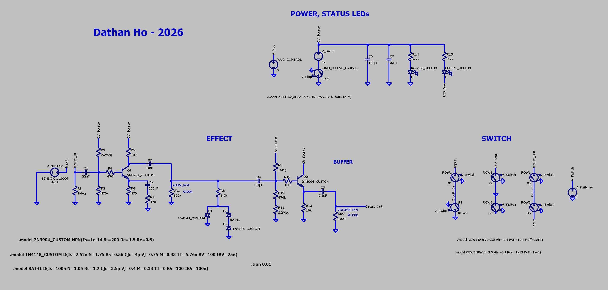

**Physical Prototype Setup**:
<br>
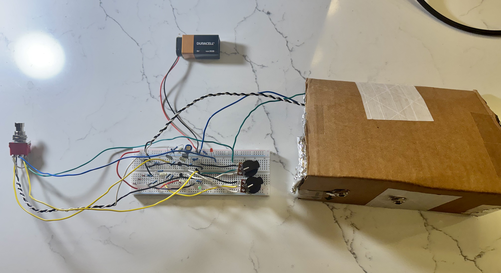

---

## 1. Project Motivation & Inspirations

Starting this project was a direct result of my passion for audio and my desire to apply classroom theory to hardware. I have prior experience as an audio engineer, but that background centered more on the musical than the electrical side. 

As a guitar player, it was only natural that I narrowed my possible project options down to building a guitar pedal. Along the way, I would be able to deepen my understanding of audio circuits and how components can affect frequency response. 

A guitar "pedal" in the simplest form is a device that applies an effect to an incoming guitar signal, with a switch that allows you to toggle between bypass and the effect. In theory, I could apply the knowledge I learned from this project to other audio systems or effects (such as microphone preamps or compressors). 

Since I only had theoretical knowledge of analog circuits and little design practice, I knew existing material would significantly hasten the learning process. So, as the foundation for my first guitar effect circuit, I drew inspiration from the Electro-Harmonix LPB-1 Linear Power Booster pedal and the Electra Distortion circuit. I would use these to craft my own unique boost/distortion effect.

*Below are the schematics for the LPB-1 and Electra Distortion along with short technical explanations:*

<br>

<div align="center">
    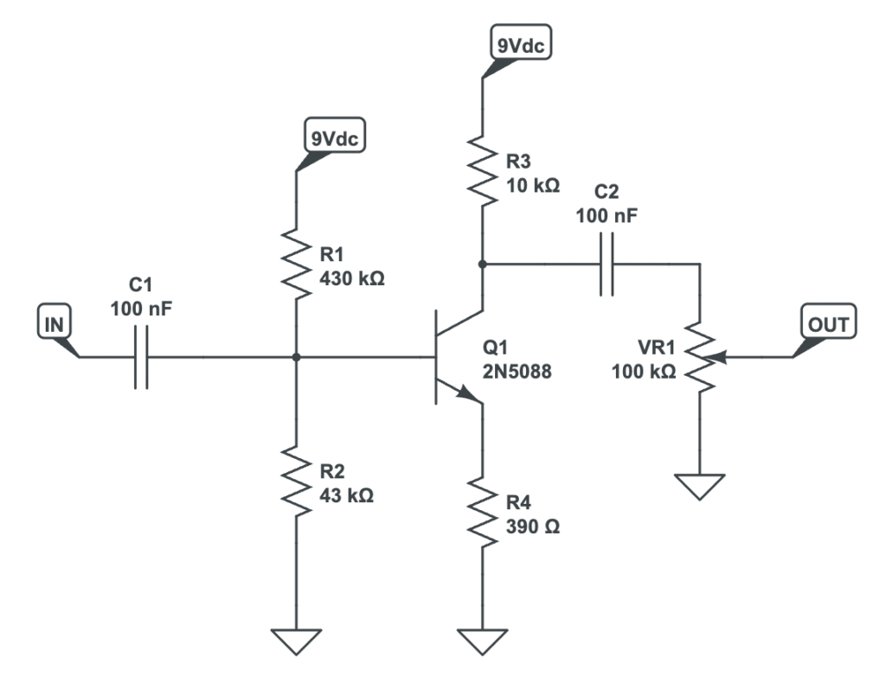
    <p><i>[1] LPB-1 Circuit Schematic.</i></p>
</div>

The LPB-1 is a simple guitar pedal that features a single NPN bipolar junction transistor (BJT) configured as a common emitter (CE) amplifier to cleanly boost volume. This common emitter amplifier uses voltage divider biasing.

<br>

<div align="center">
    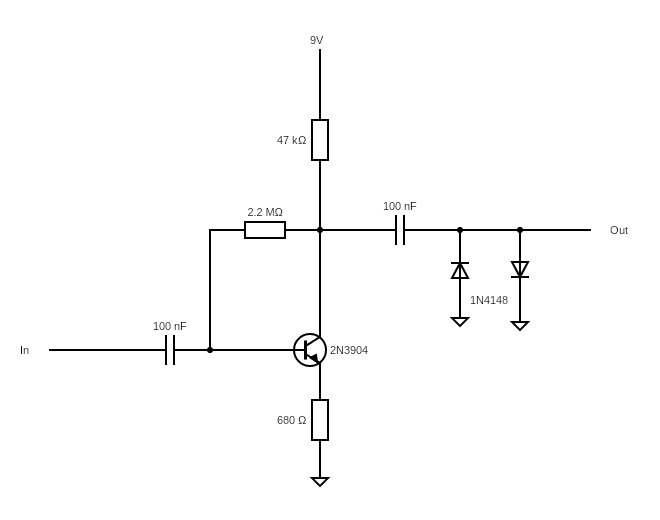
    <p><i>[2] Electra Distortion Schematic.</i></p>
</div>

The Electra Distortion is a classic guitar effects circuit, which features a single NPN BJT configured as a common emitter amplifier with the output signal connected to antiparallel shunt diodes for a distortion effect. This common emitter amplifier uses collector feedback biasing. 

## 2. Prototyping Process

After studying the basic topology behind both circuits, I decided to combine the core LPB-1 circuitry with the antiparallel clipping diodes of the Electra Distortion. I landed on this design because of the stability of voltage divider biasing found in the LPB-1 compared to collector feedback biasing. Additionally, the LPB-1 features a gain potentiometer to vary the output voltage, which can be used for adjusting the intensity of the distortion.

My plan was to design on LTspice and build the physical circuit simultaneously on a breadboard. This way I could hear the circuit at different stages and adjust or add components accordingly.

### a. Input and Output Jack Testing Enclosure

The specific jacks I had on-hand were the Neutrik REAN NYS230 and NYS229. The NYS230 is a 1/4" TRS (Tip-Ring-Sleeve, 3-pole) open jack, while the NYS229 is a 1/4" TS (Tip-Sleeve, 2-pole) open jack. I chose these connectors for their reliability, compact size, and affordability.

Since guitar signals are mono and only require a signal and ground wire, the stereo jack is able to serve an additional purpose. If used on the input side, the ring (middle conductor) can serve as a bridge between the battery's negative terminal and ground. When a standard TS plug is inserted into the TRS jack, the ring and sleeve are shorted together, connecting the battery's negative terminal to ground. As soon as the user unplugs the input jack, the battery is disconnected.

So, I soldered 22 AWG wire to each of the jack terminals and color coded accordingly. I also connected the grounds of the input jack and output jack directly to avoid forming a ground loop antenna. 

After crudely putting together a cardboard enclosure and attaching the jacks, I ended up with a movable guitar jack box:

<div align="center">
    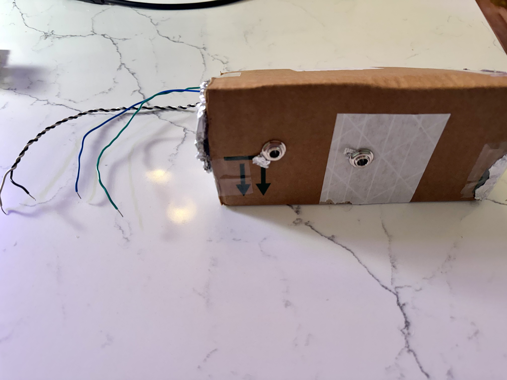
    <p><i>[3] Cardboard Jack Enclosure.</i><p>
</div>

It looks a little silly but for now gets the job done. The purpose of each wire is listed in the table: 

<div align="center">

| Wire Color | Purpose |
| :---: | :---: |
| White | Guitar Input Signal |
| Black | Ground |
| Blue | Battery Switching |
| Green | Circuit Output Signal |

</div>

I twisted the guitar input wire with the ground wire to form a twisted pair. This reduces electromagnetic interference before the signal hits amplification and happens to help keep things tidy.  

### b. Pedal Switch, LED Status Indicators

For basic switching functionality, I will be using a 3PDT (Triple-Pole, Double-Throw) switch to engage and disengage the circuit. That switch will be connected to a red LED which indicates whether or not the effect is on. A green LED will be connected straight from the battery to ground, indicating when the ring is bridged to the sleeve and the circuit has power. 

<div align="center">
    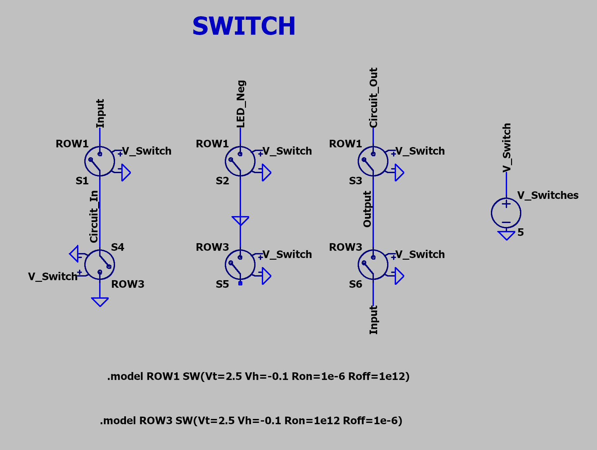
    <p><i>[4] Schematic of Simulated 3PDT Switch.</i><p>
</div>

Since LTspice does not have a native 3PDT component, I had to simulate one using 6 SPST switches and voltage sources. 

**When switch is engaged:**
- Circuit_In connects to Input
- GND connects to LED_Neg
    - Allows current to flow through the LED, turning it on
- Output connects to Circuit_Out

**When switch is disengaged:**
- Circuit_In connects to GND
    - No signal enters the circuit input
- GND connects to floating pin
    - Disconnects LED from ground, turning it off
- Output connects to Input
    - Guitar input passes directly to the output jack

Next up is the setup for the power and status LEDs.

<div align="center">
    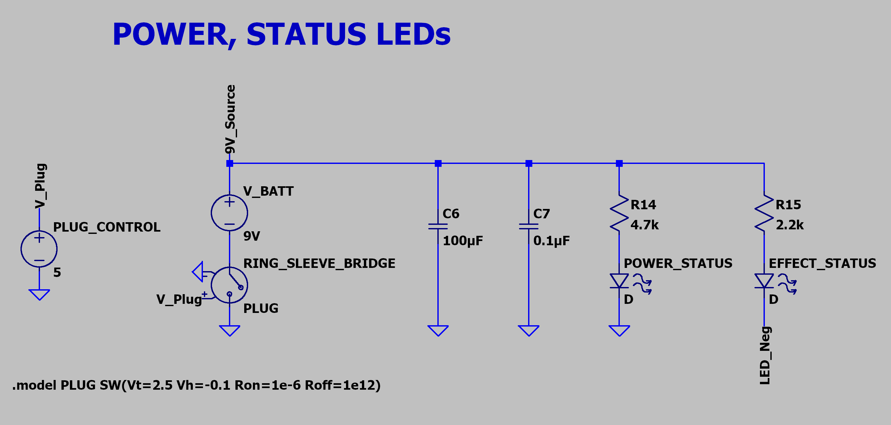
    <p><i>[5] Schematic of Power and Status LEDs Setup.</i><p>
</div>

This schematic was made just to show how the power and LED switching would work. When the ring and sleeve are bridge together, the battery is connected to ground and the circuit is powered. Once the circuit is powered, the green POWER_STATUS LED will light up. If the effect is engaged, LED_Neg would be connected to ground and the LED (red) will light up.

You will also note the additions of C6 and C7. I included these in the design when attempting to connect the LED indicators. While the connected guitar amp and effects circuit itself seemed to handle the ring-sleeve bridging without much issue, the LEDs would get momentarily bright when plugging in a cable. In some scenarios, the current through the LED would get so high that the LED would burn out. Therefore, I added the 100µF and 0.1µF capacitors for power decoupling and that fixed that issue (also helps for smoothing power in general).

### c. Gain Stage

<div align="center">
    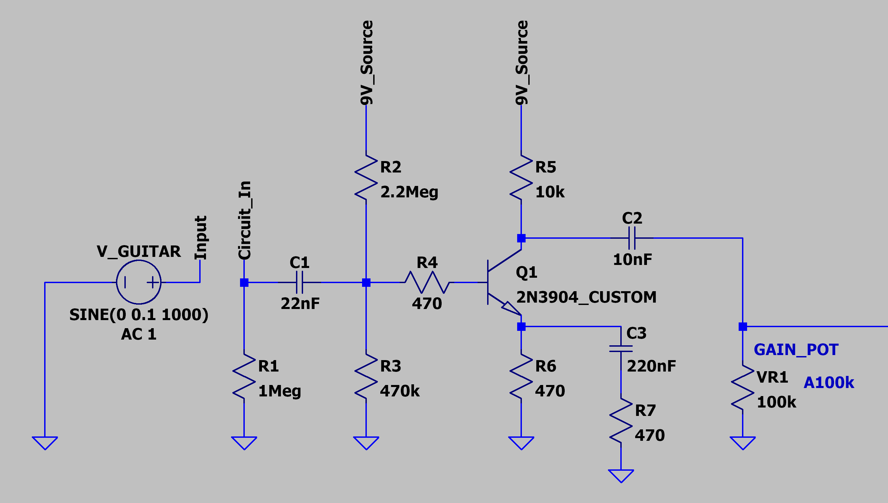
    <p><i>[6] Schematic of Custom Gain Boost Stage.</i><p>
</div>

In this section, I'll discuss each component of the gain stage and the values I chose for them. 

I did my best to lay out the process in chronological order, but because my design process included many simultaneous adjustments, it is not a perfectly ordered sequence of steps.  

#### i. Transistor: 2N3904
The transistors I had on hand were the 2N3904, 2N5088, and KSP2222A. I chose the 2N3904 for the following reasons:

Why NOT use a 2N5088? The 2N5088 has a current gain in the range of 300 to 900 compared to the 2N3904's current gain of around 100 to 300. While the difference in current gain shouldn't affect the audio voltage gain in the active region, it does affect the signal in the cutoff and saturation region. The higher current gain of the 2N5088 will cause the audio to clip harshly if pushed into cutoff/saturation, while the 2N3904 will have smoother, and in this case, more desirable crunch.

Why NOT use a KSP2222A? The KSP2222A has a max collector current of 600mA, with current gain being more stable around 10mA to 100mA. At a low 0.45mA, the current gain could fluctuate with the audio signal and warp the signal.

The 2N3904 ended up being the choice for its consistent, relatively low current gain at 0.45mA.

#### ii. Input Pulldown Resistor (R1): 1MΩ

R1 bleeds off capacitor DC leakage and static charge from the input, while also acting as a discharge path for any capacitor voltage transients. 1MΩ is the standard value for an input pulldown resistor in guitar pedal circuits. 2.2MΩ can be used to keep input impedance marginally higher, but it risks slower voltage drainage that can lead to audio pops during fast switching.

#### iii. Collector Resistor (R5): 10kΩ

I landed on 10kΩ, which is also the value found in the original LPB-1. I decided it was a good place to start for setting low current draw, since this pedal would be battery powered. In a common emitter amplifier, the majority of the current draw is determined by the collector resistor. Targeting a center bias point of around 4.5V at the collector pin, we assume a 4.5V drop across the collector resistor. This gives us a current draw of 0.45mA ($10kΩ / 4.5V$). A household 9V alkaline battery typically has a capacity of about 500mAh, which means a 0.45mA current draw is exceptionally low.

#### iv. Emitter Resistor (R6): 470Ω

The fourth step was to choose an emitter resistor (R6) value. The ratio between the collector resistor and the emitter resistor approximates the voltage gain.

$$|A_v| \approx \frac{R_c}{R_e}$$

To achieve a gain of at least 20dB for distortion in later stages, the resistance of the collector resistor must be greater than 10x the resistance of the emitter resistor. That left me with values under 1kΩ. The next lower resistor value I had was 470Ω, so I chose that as my emitter resistor value. That gives a gain of roughly 26.6 decibels.

$$|A_v|_{db} \approx 20 \cdot log_{10}(\frac{10000}{470}) \approx 26.6\text{dB}$$

#### v. Base Voltage Divider Network (R2, R3): 2.2MΩ, 470kΩ

You could approximate the target base voltage using the voltage drop across the emitter resistor (roughly 0.21V with a current of 0.45mA) and the voltage drop from base to emitter. This should get the collector pin close to 4.5V. However, after going through several designs using that method and measuring bias points from physical test circuits, I decided to create a script that could incorporate more information to directly give me an approximate collector pin voltage.

The function for this is included in the [bjt_math](src/bjt_math.py) module.

Here is a snippet of the code: 

```python
# Snippet from bjt_math.py
# 1. Use current gain and base current to find collector current
ic = hfe * ib

# 2. Calculating collector bias voltage (vc)
vc = vcc - ic*r_collector # RETURN VALUE I

# 3. Calculating emitter voltage at saturation
ic_sat = (vcc - vce_sat) / (r_collector + r_emitter)
ve_sat = ic_sat * r_emitter

# 4. Calculating collector bias voltage for max headroom
target_vc = (vcc + vce_sat + ve_sat) / 2 # RETURN VALUE II

    return vc, target_vc
```

I also created a [components](src/components.py) module which includes the component values I have access to and the specs I needed for specific calculations. The resistor and capacitor values weren't necessary for running any calculations I created yet, but they can be used to implement a script that iterates through the values and suggests values based on certain target parameters.

```python
# Snippet from components.py
# Shows the information included for diodes and transistors
# Available diodes - specs are typical values (not exact)
diodes = {
    "BAT41": {"type": "Schottky", "vf": 0.4},
    "1N4148": {"type": "Silicon Switching", "vf": 0.7 }
}

# Available transistors - specs are typical values (not exact)
transistors = {
    "2N3904": {"type": "NPN", "hfe": 200, "vbe": 0.65, "vce_sat": 0.2}
}
```

To run the calculation with specific component values, you use the [main](src/main.py) script. It outputs results for several different calculations, so the particular output we want currently is titled "1. Amplifier Stage Collector Voltage"

Sample output:

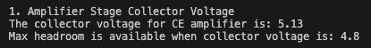

After trying a range of different values, I landed on 2.2MΩ for the upper resistor and 470kΩ for the lower resistor. At the time, I was trying to keep input impedance high and these values seemed to produce a relatively clean sound. However, after continuing with the design process, I realized this was a misguided thought-process. There is an explanation in the [Results & Improvements](#3-results--improvements) section.

#### vi. Input Coupling Capacitor (C1): 22nF

While its primary purpose is to prevent the DC bias voltage from leaking back into the guitar, it can also be used to form an RC highpass filter with the input resistance. A highpass before amplification cleans up the low-end and reduces intermodulation distortion (IMD) from low-frequency energy. The standard value for an input coupling capacitor is 100nF (0.1µF), which was originally what I had in my design. I chose to switch this to 22nF towards the end of the prototyping process since I found that complex guitar chords would cause unpleasant distortion, especially with lower notes. This proved to be a good fix, so I kept it in my final design.

#### vii. Output Coupling Capacitor (C2): 10nF

The output coupling capacitor blocks DC voltage from reaching the output, essentially removing the bias and restoring the pure AC audio signal. The original value found in the LPB-1 and many other CE amplifer based designs is 100nF. Just like the input coupling capacitor, I had used a 100nF cap for the majority of the prototyping process, but changed it to 10nF after finding that the output (post-amplification) contained too much low-end. 

#### viii. Gain Potentiometer (VR1): A100k (Audio Taper, 100kΩ)

The original LPB-1 design featured an audio (logarithmic) taper 100kΩ potentiometer and that seemed like the best choice. Audio taper allows for a more natural, intuitive sweep that follows human hearing. 100kΩ doesn't load down the audio signal significantly at full output and doesn't absorb too much of the output when turned down. In my design, it would act less as an output volume knob and more like a "gain" knob for controlling distortion intensity.  

#### ix. Emitter Bypass Network (C3, R7): 220nF, 470Ω

An emitter bypass network increases AC voltage gain for higher frequencies while keeping the DC bias points the same (since the capacitor is an open circuit at DC steady state). As frequency increases, the impedance of the capacitor decreases and allows more current to flow down this branch. I chose a resistor value of 470Ω (which matches the parallel emitter resistor) to ensure that the max AC voltage gain can only ever be double the voltage gain near DC. The capacitor value of 220nF was chosen to target a corner frequency of 1.54kHz.

$$f_c = \frac{1}{2\pi R C} = \frac{1}{2\pi \cdot 470 \cdot (220 \times 10^{-9})} \approx 1.54 \text{kHz}$$

1.54kHz is roughly where the upper mid-range bite of a guitar signal starts, so boosting above this range should help add some sparkle.

#### x. Base Stopper Resistor (R4): 470Ω

R4 prevents parasitic oscillations from unwanted LC networks by dampening the resonance. Initially, this was not an addition I made. However, I found that the circuit would create considerable noise when the guitar volume knob was at 10 or 0 (likely caused by an LC network). Adding a base stopper resistor immediately fixed that issue. I landed on 470Ω after trying a range of values in my physical circuit (10Ω-10kΩ) and listening for changes in noise and tonal quality. 

### d. Clipping Stage

<div align="center">
    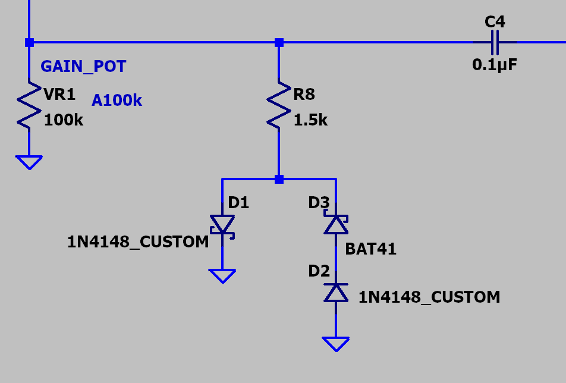
    <p><i>[7] Schematic of Custom Diode Clipping Stage.</i></p>
    <p><i>Note: VR1 and C4 are not part of this stage.</i></p>
</div>

I'll go over the asymmetrical clipping diode configuration in this section. Like the last section, I will try to describe in chronological order.

I chose to purposefully target asymmetrical clipping because it generates even-order harmonics, which are more "musical" to the ear. 

#### i. Upswing Clipping Diode (D1): 1N4148

I had an assortment of diodes available to me, which included standard silicon diodes, Schottky diodes, Zener diodes, and vintage germanium diodes. For this project, it seemed like the popular choice of a 1N4148 silicon switching diode would work well. It would give a relatively high headroom (≈0.7V) compared to the schottky (≈0.4V) or germanium diodes (≈0.3V) and is known for its "modern sounding" crunch. 

Since the human ear is phase deaf to an isolated mono signal, I arbitrarily chose the upswing to be clipped further. It seems to be common practice to do it this way as well, though I can't find any substantial evidence or technical explanation on why. It might have something to do with speaker cone movement and transients, but I haven't been able to confirm that myself.

For it to be clipped further, I made the choice to only use one 1N4148 diode on this side. This means that for the downswing, I could add an additional diode to increase the headroom and change the clipping characteristics.

#### ii. Downswing Clipping Diodes (D2, D3): 1N4148, BAT41

I used the 1N4148 as the baseline diode since the upswing clipping diode was also a 1N4148. I needed to add another diode to change the downswing and cause the signal to clip asymmetrically. I landed on the BAT41 for the second diode since it has a low forward voltage of ≈0.4V and supposedly warmer clipping characteristics. The low forward voltage should mean that the downswing wouldn't differ too much from the upswing, preventing a sputtering fuzz.

#### iii. Series Limiting Resistor (R8): 1.5kΩ

This resistor limits the current flowing through the diodes, which softens the knee (response curve) of the compression and adds additional headroom. For this resistor, I simply started with a 470Ω resistor and listened to the output. I adjusted the resistor value until I heard a distortion characteristic that I liked.

### e. Output Buffer Stage

<div align="center">
    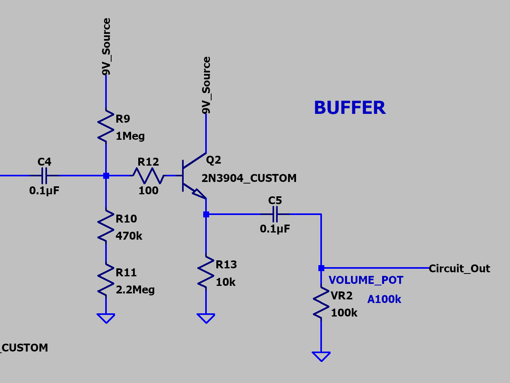
    <p><i>[8] Schematic of Custom Output Buffer Stage.</i></p>
</div>

With the gain pot changing the aggressiveness of the distortion, I wanted another potentiometer to act as the master volume. The issue is that attaching it directly to the output from the gain pot would significantly load down the output signal and increase output impedance. Therefore, I decided to add an emitter follower to act as a voltage buffer.

#### i. Transistor: 2N3904

To keep it simple, I decided to use the same transistor as the gain boost stage.

#### ii. Input and Output Coupling Capacitor (C4, C5): 0.1µF

The standard value for AC coupling capacitors in transistor based guitar circuits. I tested them on the physical circuit and didn't notice any substantial changes to the audio signal. 

#### iii. Emitter Resistor (R13): 10kΩ

With a typical DC current gain of 200 for the 2N3904, the approximate input impedance looking into the base of the transistor is the emitter resistor multiplied by 200. With an emitter resistor resistance of 10kΩ, the equivalent impedance at the base is roughly 2MΩ. This value is good for maintaining a high input impedance when in parallel with the voltage divider network. Additionally, when aiming for an emitter voltage of 4.5V (mid-point of 9V supply), the operating current drawn from the battery is only 0.45mA.

#### iv. Base Voltage Divider Network (R9, R10, R11): 1MΩ, 470kΩ, 2.2MΩ

Just like with the voltage divider network for the amplification stage, I also wrote a script for the buffer stage. The function is found in the same [bjt_math](src/bjt_math.py) module as the one for the common emitter amplifier.

Using the component specs from [components](src/components.py), the [main](src/main.py) script calculates and outputs the approximate emitter voltage based on the component values you choose.

Aiming to keep input impedance high, I targeted values in the mega-ohm range and used the script to land on the values of 1MΩ, 470kΩ, and 2.2MΩ. 

#### v. Base Stopper Resistor (R12): 100Ω

The reasoning for this one is exactly the same as for [R4](#x-base-stopper-resistor-r4-470ω). This resistor prevents parasitic oscillations from occurring. There wasn't any audible noise without it, so including this component was more of a preventative measure. 100Ω seemed to be a safe value and hasn't affected tonality or performance in any way from my testing.

#### vi. Volume Potentiometer (VR2): A100K (Audio Taper, 100kΩ)

This component was essentially the entire reason for adding the buffer. I wanted master volume control independent of the clipping stage. Just like with the gain potentiometer, audio taper allows for a more natural sweep and a resistance of 100kΩ prevents loading down the signal while keeping output impedance relatively low. 

## 3. Results & Improvements

<div align="center">
    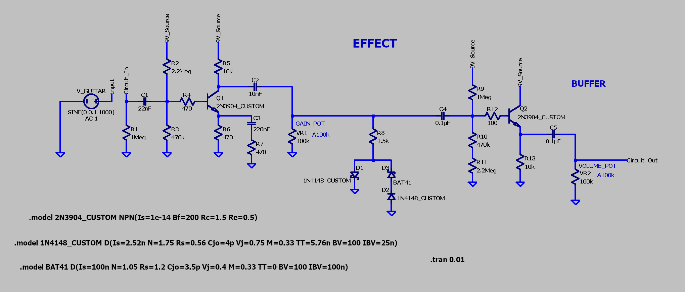
    <p><i>[9] Schematic of Final Effects Circuit.</i></p>
</div>

<div align="center">
    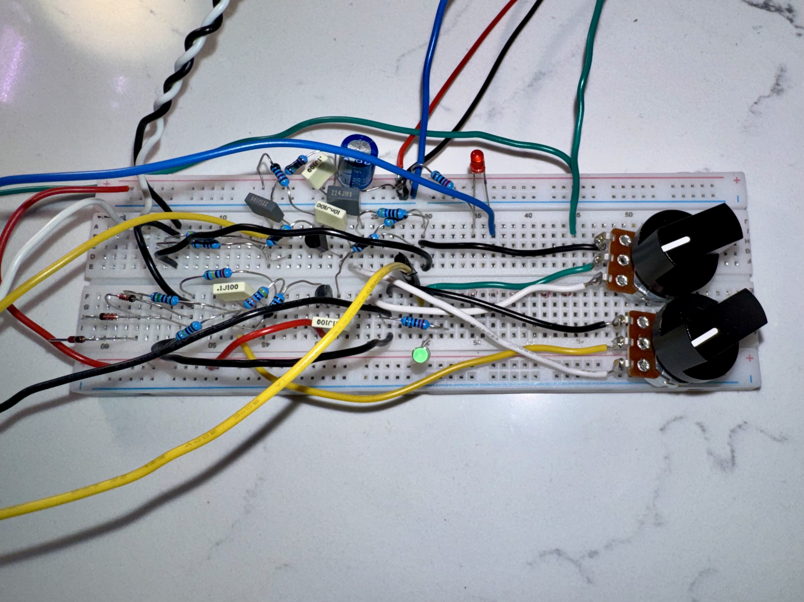
    <p><i>[10] Effects Circuit Breadboard Prototype.</i></p>
</div>

[Audio Samples and Video Demonstration Coming Soon]

The resulting functionality of the final effects circuit is just what I had hoped. It acts as warm, slightly saturated boost at very low gain levels, a touch-sensitive overdrive at medium gain levels, and a heavy distortion pedal at high gain levels.

However, I think that the tonality and sound characteristics are not yet rich and distinctive enough to be used in commercial audio recordings. If I were to spend additional time in the design stage, I would focus on tuning the AC coupling cap values, emitter bypass network, and most importantly, the clipping stage.

Furthermore, there was one major technical misunderstanding that I originally had in the early design process that led to suboptimal component choices.

In the voltage divider network for the base of the common emitter amplifier, the resistor values should have been drastically lower. While I initially thought that high values would increase input impedance, that seemed to be an inaccurate assumption. The input impedance of the common emitter amplifier includes the equivalent impedance looking into the base in parallel with the base bias resistors. Since the equivalent base impedance is only in the range of kilo-Ohms, having such high voltage divider resistors has little effect on the input impedance.

Along with not substantially increasing input impedance, the high resistance introduces two main issues. 

When looking out from the base of the transistor, a high Thevenin (equivalent) resistance means that the small current flowing into the base creates a significant voltage drop. Since DC current gain fluctuates with temperature and changes between individual transistors, the high resistance leads to unpredictable variations in the base voltage depending on the precise temperature and component. This can negatively affect the consistency of the amplifier headroom.

The second issue is slow recovery times. The input coupling capacitor C1 and the resistor network forms an RC circuit. Since the RC time constant is calculated with the equation $τ = R \cdot C$, the high resistance means that the time constant sits in the millisecond range. A value that high means that the capacitor has time to build up a charge and shift the DC bias temporarily when the audio signal is strong and rapidly fluctuating. This shift results in a portion of time when the transistor is trapped in the "cutoff region". During my testing, I was actually able to hear this as a sputtering, fuzz-like sound when strumming intensely.

But apart from those minor issues, this project turned out to be quite successful as a personal project. I was able to learn a decent amount about guitar pedal design, transistor configurations, and general electrical engineering concepts. In the future, I plan on laying out optimized designs onto a PCB and placing them into 1590B aluminum enclosures. Before that though, my next project will be designing an op-amp based guitar pedal circuit.

---

## Bill of Materials (BOM)

### Active Components & Diodes
| Reference | Part / Component | Description | Quantity |
| :--- | :--- | :--- | :--- |
| Q1, Q2 | 2N3904 | NPN General Purpose BJT Transistor | 2 |
| D1, D2 | 1N4148 | Silicon Switching Diode ($V_f \approx 0.7\text{V}$) | 2 |
| D3 | BAT41 | Schottky Barrier Diode ($V_f \approx 0.4\text{V}$) | 1 |
| POWER_STATUS | Standard 3mm Green LED | Power Indicator | 1 |
| EFFECT_STATUS | Standard 3mm Red LED | Effect Engagement Indicator | 1 |

### Resistors
| Reference | Value | Rating / Type | Function | Quantity |
| :--- | :--- | :--- | :--- | :--- |
| R1 | 1MΩ | 1/4W 1% Metal Film | Input Pull-Down Resistor | 1 |
| R2 | 2.2MΩ | 1/4W 1% Metal Film | Q1 Base Bias Upper Resistor | 1 |
| R3 | 470kΩ | 1/4W 1% Metal Film | Q1 Base Bias Lower Resistor | 1 |
| R4 | 470Ω | 1/4W 1% Metal Film | Q1 Base Stopper Resistor | 1 |
| R5 | 10kΩ | 1/4W 1% Metal Film | Q1 Collector Load Resistor | 1 |
| R6 | 470Ω | 1/4W 1% Metal Film | Q1 Emitter Bias Resistor | 1 |
| R7 | 470Ω | 1/4W 1% Metal Film | Q1 AC Emitter Bypass Resistor | 1 |
| R8 | 1.5kΩ | 1/4W 1% Metal Film | Series Limiting Resistor | 1 |
| R9 | 1MΩ | 1/4W 1% Metal Film | Q2 Base Bias Upper Resistor | 1 |
| R10 | 470kΩ | 1/4W 1% Metal Film | Q2 Base Bias Lower Resistor | 1 |
| R11 | 2.2MΩ | 1/4W 1% Metal Film | Q2 Base Bias Lower Resistor | 1 |
| R12 | 100Ω | 1/4W 1% Metal Film | Q2 Base Stopper Resistor | 1 |
| R13 | 10kΩ | 1/4W 1% Metal Film | Q2 Emitter Load Resistor | 1 |
| R14 | 4.7kΩ | 1/4W 1% Metal Film | Power LED Current Limiter | 1 |
| R15 | 2.2kΩ | 1/4W 1% Metal Film | Effect LED Current Limiter | 1 |

### Capacitors
| Reference | Value | Rating / Type | Function | Quantity |
| :--- | :--- | :--- | :--- | :--- |
| C1 | 22nF | 100V 5% Polyester Film | Input Coupling Cap, Gain Stage | 1 |
| C2 | 10nF | 100V 5% Polyester Film | Output Coupling Cap, Gain Stage | 1 |
| C3 | 220nF | 100V 5% Polyester Film | AC Emitter Bypass Capacitor | 1 |
| C4 | 0.1µF | 100V 5% Polyester Film | Input Coupling Cap, Buffer Stage | 1 |
| C5 | 0.1µF | 100V 5% Polyester Film | Output Coupling Cap, Buffer Stage | 1 |
| C6 | 100µF | 50V 20% Electrolytic | Power Decoupling | 1 |
| C7 | 0.1µF | 100V 5% Polyester Film | Power Decoupling | 1 |

### Additional Hardware
| Reference | Component / Value | Details | Quantity |
| :--- | :--- | :--- | :--- |
| VR1 (GAIN_POT) | A100k Potentiometer | Audio Taper (Clipping Level) | 1 |
| VR2 (VOLUME_POT) | A100k Potentiometer | Audio Taper (Master Output Volume) | 1 |
| Knobs | Black Aluminum Davies Knobs | Potentiometer Adjustment | 2 |
| Input Jack | REAN NYS230 | 1/4" Stereo (TRS) Switched Jack | 1 |
| Output Jack | REAN NYS229 | 1/4" Mono (TS) Jack | 1 |
| Footswitch | 3PDT Switch | Bypass / Effect | 1 |
| 9V_Source | 9V DC Battery | Alkaline, ≈500mAh | 1 |
| Power Connector | 9V Battery Clip | Connector Snap with Wire Leads | 1 |
| Wire | Assortment of 22 AWG Wire | Connecting Guitar Jacks, Switch | N/A |

## Acknowledgements
This project was built upon the foundations of free-to-use, publicly available circuit schematics.
* [1] [EHX LPB-1 Circuit Overview](https://stompboxelectronics.com/2023/02/28/diving-into-the-ehx-lpb-1-circuit/). Stompbox Electronics.
* [2] [Building A Simple Distortion Pedal Based On The Electra Distortion](https://crazychickenguitarpedals.com/guitar-pedal-blog/guitar-pedal-builds/building-a-simple-distortion-pedal-based-on-the-electra-distortion/). Crazy Chicken Guitar Pedals.

